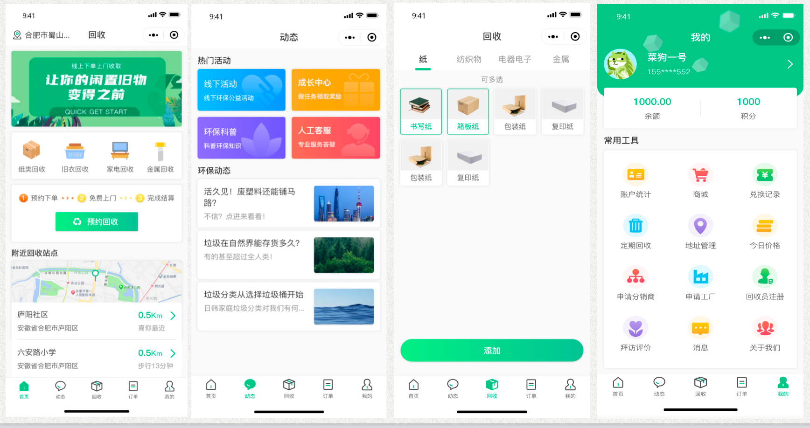
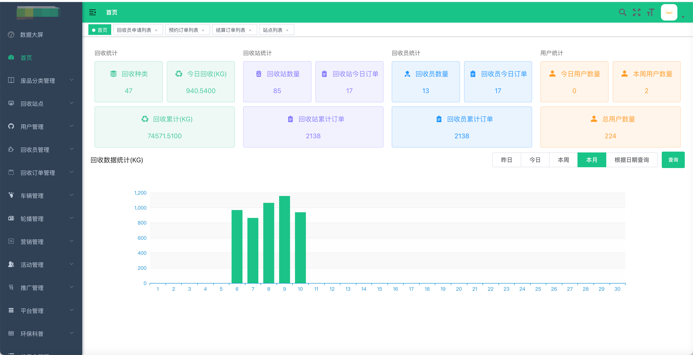
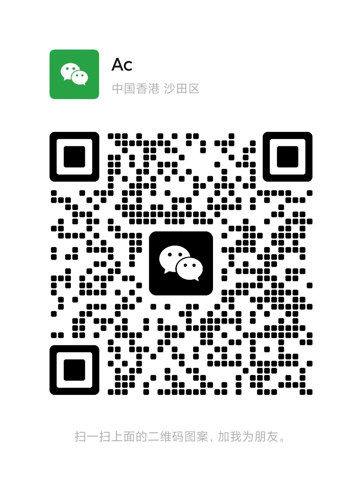

# 废品回收小程序平台

#### 介绍
基于JAVA Spring Boot + 微信小程序的废品回收管理平台，有管理员，回收员，用户三个角色，分别对应系统后台、回收员端小程序、用户端小程序。

1、用户端功能有个人中心，订单管理，附近回收站，活动列表，预约下单，积分商城，废品列表等。

2、管理员功能有用户管理，回收员管理，废品类型管理，废品回收站管理，废品订单管理，系统管理等。

3、回收员端录，查看废品回收、废品订单、订单抢单等。

#### 软件架构
软件架构图

软件功能图

#### 软件截图

用户端

管理端

#### 完整源码联系方式

